# Jarkom Hands On TCP UDP
|NRP|Nama|Kelas|
|-|-|-|
|5025211016|Thomas Juan Mahardika Suryono|Jarkom D|
## TCP
### Soal 1
What is the IP address and TCP port number used by the client computer (source) that is transferring the alice.txt file to gaia.cs.umass.edu?
### Jawaban 1
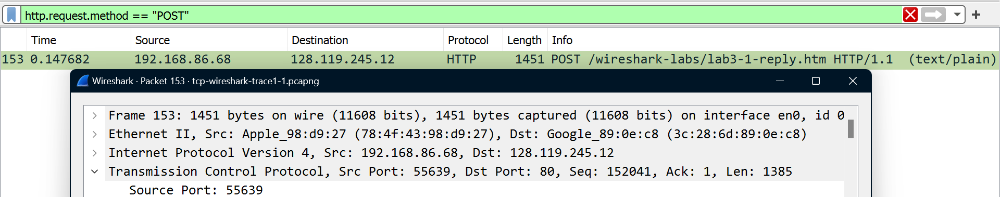
IP address : 192.168.86.68
Port : 55639
### Soal 2
What is the IP address of gaia.cs.umass.edu? On what port number is it sending and receiving TCP segments for this connection?
### Jawaban 2
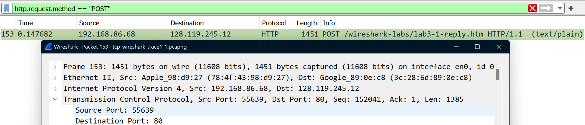
IP address : 128.119.245.12
Port : 80
### Soal 3
1. What is the sequence number of the TCP SYN segment that is used to initiate the TCP connection between the client computer and gaia.cs.umass.edu?
2. What is it in this TCP segment that identifies the segment as a SYN segment?
3. Will the TCP receiver in this session be able to use Selective Acknowledgments?
### Jawaban 3
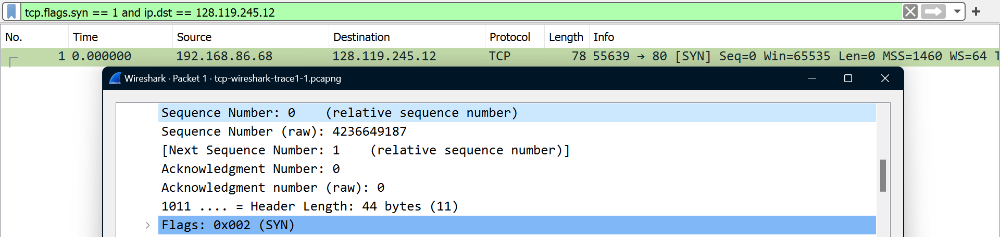
1. Sequence Number: 0 dan Sequence Number (raw) : 4236649187
2. Karena memiliki Flags: 0x002 (SYN)
3. Iya, karena SACK diizinkan dalam segmen SYN
### Soal 4
1. What is the sequence number of the SYNACK segment sent by gaia.cs.umass.edu to the client computer in reply to the SYN?
2. What is it in the segment that identifies the segment as a SYNACK segment?
3. What is the value of the Acknowledgement field in the SYNACK segment?
4. How did gaia.cs.umass.edu determine that value?
### Jawaban 4
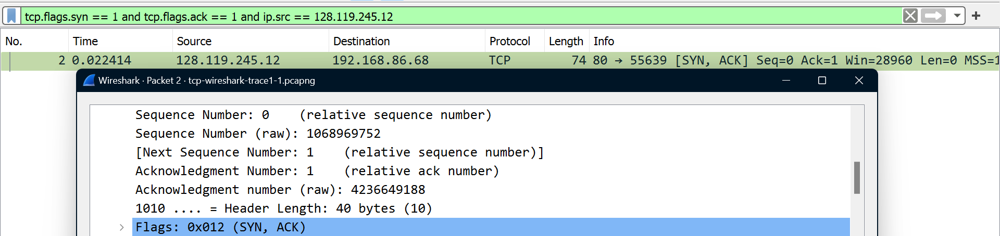
1. Sequence Number: 0 dan Sequence Number (raw) : 1068969752
2. Karena memiliki Flags : 0x012 (SYN, ACK)
3. Acknowledgment number : 4236649188
4. Dari sequence number segmen SYN sebelumnya, yakni 4236649187, ditambah 1
### Soal 5
1. What is the sequence number of the TCP segment containing the header of the HTTP POST command?
2. How many bytes of data are contained in the payload (data) field of this TCP segment?
3. Did all of the data in the transferred file alice.txt fit into this single segment?
### Jawaban 5
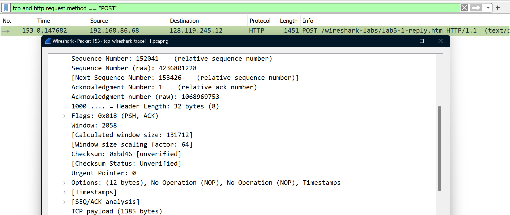
1. Sequence Number: 152041 dan Sequence Number (raw): 4236801228
2. TCP payload (1385 bytes)
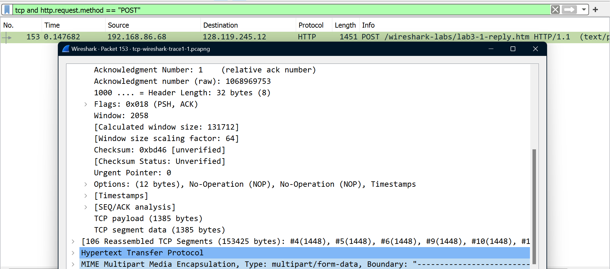
3. Tidak, karena paket dikirim menggunakan MIME multipart
### Soal 6
Consider the TCP segment containing the HTTP “POST” as the first segment in the data transfer part of the TCP connection.
1. At what time was the first segment (the one containing the HTTP POST) in the data-transfer part of the TCP connection sent?
2. At what time was the ACK for this first data-containing segment received?
3. What is the RTT for this first data-containing segment?
4. What is the RTT value the second data-carrying TCP segment and its ACK?
### Jawaban 6
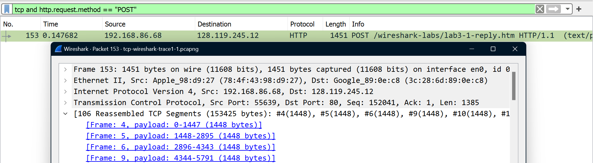
Segmen pertama dikirim pada frame: 4, segmen kedua dikirim pada frame 5
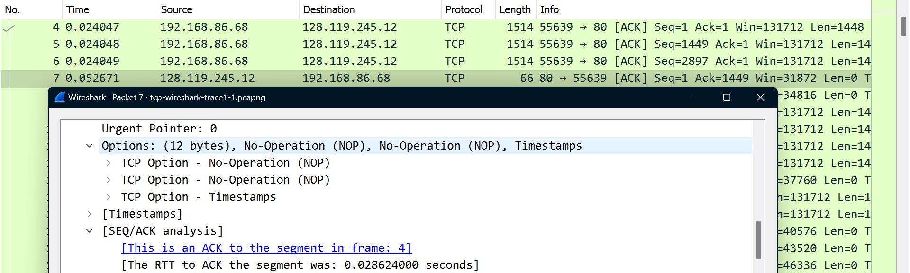
1. 0.24047
2. 0.052671
3. 0.028624
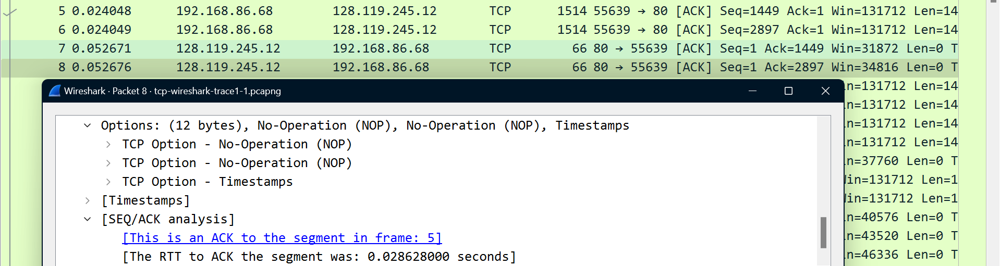
4. 0.028628
### Soal 7
What is the length (header plus payload) of each of the first four data-carrying TCP segments?
### Jawaban 7

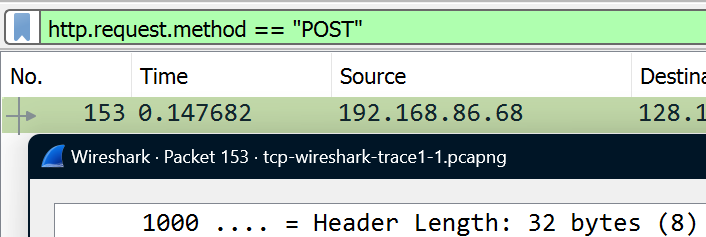
4 * (Payload + Header) = 4 * (1448 + 32) = 4 * 1480 = 5920 byte
### Soal 8
1. What is the minimum amount of available buffer space advertised to the client by gaia.cs.umass.edu among these first four data-carrying TCP segments?
2. Does the lack of receiver buffer space ever throttle the sender for these first four datacarrying segments?
### Jawaban 8
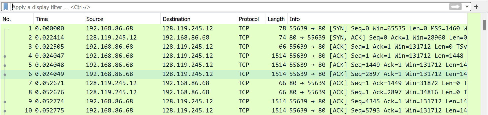
1. 13712 yang didapat dari window size value
2. Receiver buffer spacer tidak pernah throttle sender karena window size value selalu lebih besar dari length
### Soal 9
1. Are there any retransmitted segments in the trace file?
2. What did you check for (in the trace) in order to answer this question?
### Jawaban 9
1. Ada
2. Retransmitted segments dapat dideteksi melalui sequence number. Ketika melakukan pengiriman ulang, terdapat paket yang sequence number paket selanjutnya tidak lebih besar dari sequence number paket sebelumnya.
### Soal 10
1. How much data does the receiver typically acknowledge in an ACK among the first ten data-carrying segments sent from the client to gaia.cs.umass.edu?
2. Can you identify cases where the receiver is ACKing every other received segment among these first ten data-carrying segments?
### Jawaban 10
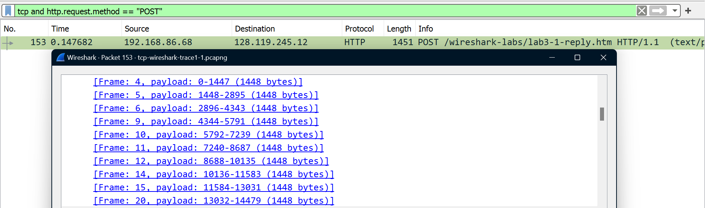
1. 1448 byte
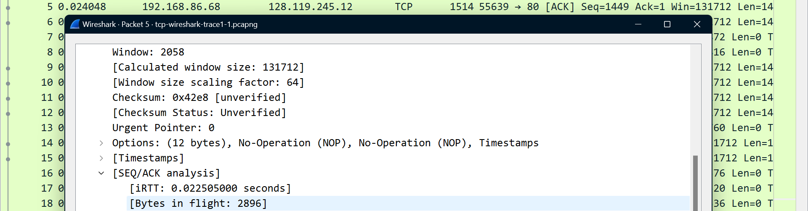
2. Jika data terdouble, segmen acking pada setiap segmen yang diterima, contohnya pada segmen kedua yang datanya terdouble dari 1448 menjadi 2896 byte
## UDP
### Soal 1
Select the first UDP segment in your trace. 
1. What is the packet number of this segment in the trace file?
2. What type of application-layer payload or protocol message is being carried in this UDP segment?
3. How many fields there are in the UDP header?
### Jawaban 1
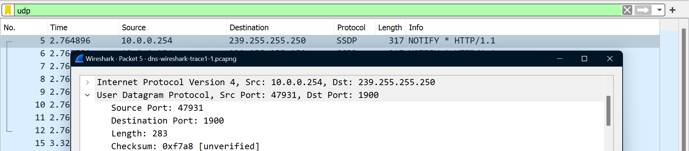
1. Packet number : 5
2. SSDP (Simple Service Discovery Protocol)
3. 4 field, source port, destination port, length, dan checksum
### Soal 2
What is the length (in bytes) of each of the UDP header fields?
### Jawaban 2
Setiap field berukuran 2 byte sehingga totalnya 8 byte karena header memiliki 4 field
### Soal 3
The value in the Length field is the length of what?
### Jawaban 3
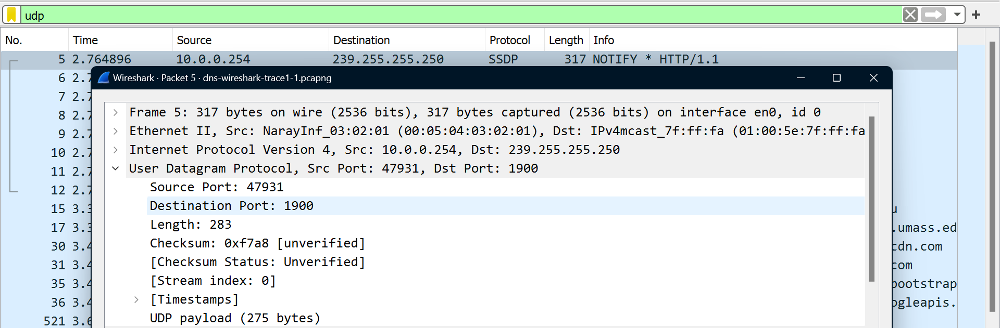
Field length merupakan panjang keseluruhan segmen UDP yang mencakup header dan payloa4. Pada gambar di atas, nilai length 283 byte didapat dari header (8 byte) ditambah payload (275 byte)
### Soal 4
What is the maximum number of bytes that can be included in a UDP payload?
### Jawaban 4
UDP berfield 16-bit yang memiliki panjang maksimum 65.535 byte, tetapi karena terdapat header (8 byte) maka panjang maksimumnya menjadi 65.527 byte
### Soal 5
What is the largest possible source port number?
### Jawaban 5
65535, karena port direpresentasikan dengan 16 bit sehingga nomor yang memungkinkan antara 0 hingga 65535 (2^16 - 1)
### Soal 6
What is the protocol number for UDP?
### Jawaban 6
17
### Soal 7
Examine the pair of UDP packets in which your host sends the first UDP packet and the second UDP packet is a reply to this first UDP packet.
1. What is the packet number of the first of these two UDP segments in the trace file?
2. What is the packet number of the second of these two UDP segments in the trace file?
3. Describe the relationship between the port numbers in the two packets
### Jawaban 7
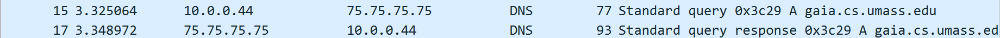
1. 15
2. 17
3. Port source paket 15 adalah port destination paket 17 dan sebaliknya.